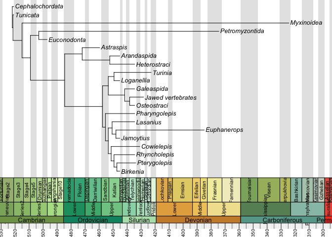

Character rates pipeline
================
RPDearden
07/11/2018

This is me having a play with the character rate functionalities of Claddis, using the matrix from [Keating *et al.* 2016](http://rspb.royalsocietypublishing.org/content/283/1826/20152917). The tree is a majority rule consensus I obtained by running the dataset in PAUP\*, and the dates are cobbled together from the literature.

### Preliminaries

Read in required packages

``` r
library(Claddis)
library(paleotree)
library(strap)
```

Set directory and read in nexus file - NOTE ReadMorphNexus reads in both ? and - as NA - instead I have read the matrix in as a csv file (by copying and pasting from Mesquite because I am basic)

``` r
setwd("~/Documents/Side_projects/Masters_writeup/EarlyVerts_R_Code/CharRates_pipeline")
Kdata <- ReadMorphNexus("../Keating16.nex")
Ktree <- read.nexus("../KeatMaj.tre")
Kdates <- read.csv("../Keating16Dates.csv", header=TRUE,row.names=1)
```

Prepare tree - think about how break polytomies (either many random iterations or by time of branching in paleotree)). Also think about best way to date tree - better from molecular info?

``` r
#Break polytomies randomly
Ktree <- multi2di(Ktree)
#Reorder dates file to get in line with tree file
Kdates <- Kdates[match(Ktree$tip.label, rownames(Kdates)),]
#Scale tree using fads and lads
Ktree <- DatePhylo(Ktree, Kdates,method="equal", rlen=1)
#plot with geoscale (to check worked)
geoscalePhylo(ladderize(Ktree), cex.age=0.6, cex.ts=0.8, cex.tip=0.8)
```



<!-- #Prune above to get in line with daterr MAY NOT NEED THIS BUT JUST IN CASE-->
<!-- nms.id <- complete.cases(daterr)               # labels the taxa with complete data -->
<!-- daterr <- as.matrix(daterr[nms.id,])       # saves the labelled taxa -->
<!-- nms.id <- complete.cases(ages.tree)                # labels the taxa with complete data -->
<!-- drop.names <- rownames(ages.tree)[!nms.id]         # switches labelling of TRUE and FALSE #switched up from below to fix -->
<!-- ages.tree <- as.matrix(ages.tree[nms.id,])         # saves the labelled taxa -->
<!-- tree.data <- drop.tip(tree.data, drop.names)   # returns a list of taxa with complete data -->
Discrete character rates with Claddis

``` r
#Calculate rates
rate.data <- DiscreteCharacterRate(Ktree, Kdata, seq(Ktree$root.time, Ktree$root.time - max(diag(vcv(Ktree))), length.out=6), alpha=0.01)
```

    ## H_0 - all rates equal across time bins - cannot be rejected at an alpha of 0.01 (Actual p = 0.0211606129017511).
    ## Calculations of per-bin rates aborted.

    ## H_0 - all rates equal across time bins - cannot be rejected at an alpha of 0.01 (Actual p = 0.0211606129017511).
    ## A single rate of 0.415425241789986is preferred.

    ## H_0 - all rates equal across the tree - is rejected at an alpha of 0.01 (actual p = 1.08972876567398e-19).
    ## Continuing to per-branch and per-clade rate calculations.

Plot with edges

``` r
#Set up edge colours
edge.color <- rep("black", nrow(Ktree$edge))
edge.color[which(rate.data$branch.results[, "ml.signif.hi"] == 1)] <- "red"
edge.color[which(rate.data$branch.results[, "ml.signif.lo"] == 1)] <- "blue"

#Plot with these colours
# pdf("VertEdgeRates.pdf")
geoscalePhylo(ladderize(Ktree), cex.age=0.6, cex.ts=0.8, cex.tip=0.8, edge.color=edge.color[match(ladderize(Ktree)$edge[, 2], Ktree$edge[,2])])
```


``` r
# dev.off()
```

Plot for nodes

``` r
#Set up node colours
node.color <- rep("white", nrow(rate.data$node.results))
node.color[which(rate.data$node.results[, "ml.signif.hi.ib"] == 1)] <- "red"
node.color[which(rate.data$node.results[, "ml.signif.lo.ib"] == 1)] <- "blue"
node.color[which(is.na(rate.data$node.results[, "ml.signif.lo.ib"]))] <- NA

# Plot tree with node rates
#pdf("VertNodeRates.pdf")
geoscalePhylo(Ktree, cex.age=0.6, cex.ts=0.8, cex.tip=0.8)
nodelabels(node=rate.data$node.results[, "node"][!is.na(node.color)], pch=21, col="black", bg=node.color[!is.na(node.color)])
```


``` r
#dev.off()
```
