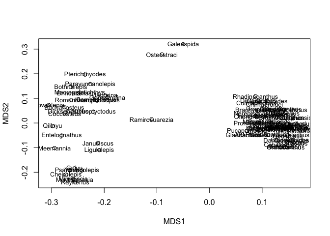
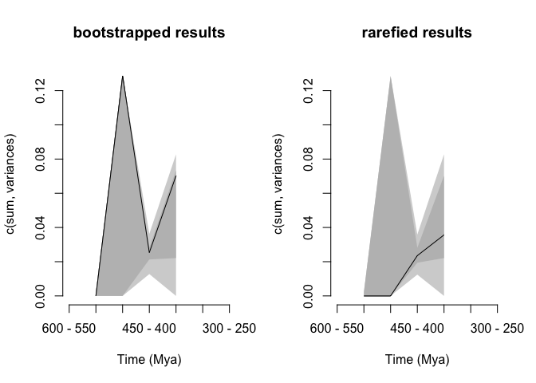
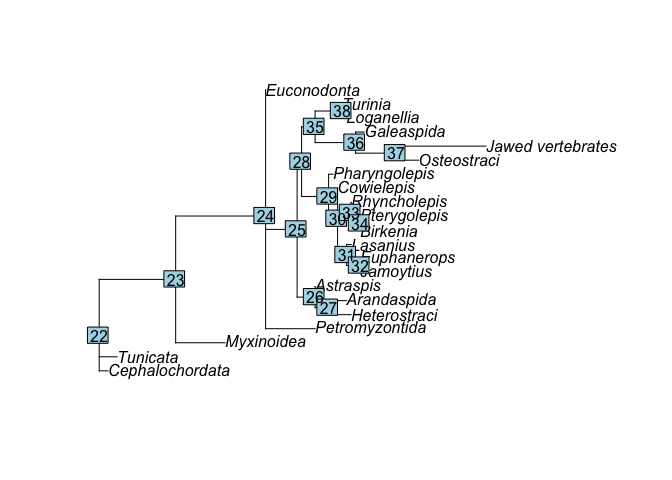

Early vertebrates dispRity pipeline
================
RPDearden
06/11/2018

This is me having a play with the functionalities of dispRity, using the matrix from [Keating *et al.* 2016](http://rspb.royalsocietypublishing.org/content/283/1826/20152917). The tree is a majority rule consensus I obtained by running the dataset in PAUP\*, and the dates are cobbled together from the literature.

### Preliminaries

Read in required packages

``` r
library(dispRity)
library(geomorph)
library(vegan)
library(cluster)
library(Claddis)
```

Set directory and read in nexus file - NOTE ReadMorphNexus reads in both ? and - as NA - instead I have read the matrix in as a csv file (by copying and pasting from Mesquite because I am basic)

``` r
setwd("~/Documents/Side_projects/Masters_writeup/EarlyVerts_R_Code/dispRity_Pipeline")
#Kdata <- ReadMorphNexus("../Keating16.nex")
Ktree <- read.nexus("../KeatMaj.tre")
Kdates <- read.csv("../Keating16Dates.csv", header=TRUE,row.names=1)
Kmatrix <- read.csv("../Keating16.csv", header=TRUE, row.names=1, stringsAsFactors = FALSE, na.strings="?") #Reads ? as NA?
```

This chunk codes ? as NA, - as 0 and bumps all scorings up one, to differentiate between inapplicables and unknowns. This follows the method of [Deline 2009](http://www.bioone.org/doi/10.1666/08028.1), [Deline and Ausich 2011](https://www.cambridge.org/core/journals/paleobiology/article/testing-the-plateau-a-reexamination-of-disparity-and-morphologic-constraints-in-early-paleozoic-crinoids/1952AFA60EAFED43C2E221F79650F992), and [Deline *et al.* 2018](http://www.pnas.org/content/115/38/E8909)

``` r
#Replace - with -1 (will become 0 later)
Kmatrix[Kmatrix=="-"] <- -1
#Convert all remaining character columns into numeric
indx <- sapply(Kmatrix, is.character)
Kmatrix[indx] <- lapply(Kmatrix[indx], function(Kmatrix) as.numeric(as.character(Kmatrix))) 
 #Add 1 to all values
Kdata <- Kmatrix+1
```

Distances are calculated using Gower's coefficient. This rescales the calculable distances based on the amount of information available, allowing for missing values (see Lloyd 2016). Lloyd (2016) performs a comparison of distance methods and tentatively recommends MORD (maximum observable rescaled distance). Worth using?

Ordination is carried out with NMDS - resistant to missing data? Probably worth doing with PCA as well.

``` r
#Calculate distances with Gower's coefficient
Kdistances=daisy(Kdata, metric=c("gower"))
#Ordinate usiing NMDS
kdataNMDS<-metaMDS(Kdistances, k=3, zerodist="add")
```

    ## Run 0 stress 0.0604045 
    ## Run 1 stress 0.06740745 
    ## Run 2 stress 0.0660669 
    ## Run 3 stress 0.06846679 
    ## Run 4 stress 0.06538884 
    ## Run 5 stress 0.06527691 
    ## Run 6 stress 0.06604312 
    ## Run 7 stress 0.06741814 
    ## Run 8 stress 0.06402216 
    ## Run 9 stress 0.06527877 
    ## Run 10 stress 0.06740944 
    ## Run 11 stress 0.06402973 
    ## Run 12 stress 0.06040652 
    ## ... Procrustes: rmse 0.001579357  max resid 0.003346129 
    ## ... Similar to previous best
    ## Run 13 stress 0.06527515 
    ## Run 14 stress 0.06527588 
    ## Run 15 stress 0.06604696 
    ## Run 16 stress 0.06040338 
    ## ... New best solution
    ## ... Procrustes: rmse 0.001154672  max resid 0.002162448 
    ## ... Similar to previous best
    ## Run 17 stress 0.06740945 
    ## Run 18 stress 0.06846559 
    ## Run 19 stress 0.06040543 
    ## ... Procrustes: rmse 0.0007155639  max resid 0.001350343 
    ## ... Similar to previous best
    ## Run 20 stress 0.06539064 
    ## *** Solution reached

``` r
#n.b. Ordination is stored in:
Ordkdata<-kdataNMDS$points
```

Plot first two axes of NMDS - plot looks like the back end of a bus but not much point twiddling currently

``` r
#Normal with text
plot(kdataNMDS)
```

    ## species scores not available

``` r
text(kdataNMDS, cex=0.8)
```



Test stresses (results hidden cos long)

``` r
#Run metaMDS with different numbers of axes
NMDS1=metaMDS(Kdistances, k=1, zerodist="add")
NMDS2=metaMDS(Kdistances, k=2, zerodist="add")
NMDS3=metaMDS(Kdistances, k=3, zerodist="add")
NMDS4=metaMDS(Kdistances, k=4, zerodist="add")
NMDS5=metaMDS(Kdistances, k=5, zerodist="add")
NMDS6=metaMDS(Kdistances, k=6, zerodist="add")
NMDS7=metaMDS(Kdistances, k=7, zerodist="add")
NMDS8=metaMDS(Kdistances, k=8, zerodist="add")
NMDS9=metaMDS(Kdistances, k=9, zerodist="add")
NMDS10=metaMDS(Kdistances, k=10, zerodist="add")

#Make vector containing stresses
Stresses=c(NMDS1$stress, NMDS2$stress, NMDS3$stress, NMDS4$stress, NMDS5$stress, NMDS6$stress, NMDS7$stress, NMDS8$stress, NMDS9$stress, NMDS10$stress)
#Plot it
barplot(Stresses, ylim=c(0, 0.30), names.arg=c(1:10), xlab="No. of axes", ylab="Stress")
```


Stacked ordination spaces in Claddis

``` r
#define
time_slices <- c(541,485,444,419,359)
#Define groups and assign randomly
groups <- sample(x = c("red", "blue"), size = nrow(Ordkdata), replace = TRUE)
names(groups) <- rownames(Ordkdata)
#Make stacked ordination plots for geological periods
StackPlot(ordination_axes=Ordkdata, ages=Kdates, groups=groups, time_slices=time_slices)
```


And MultiOrdinationSpace

<!-- Alternatively originally did like below lazily using default Claddis.ordination settings, but have a think about appropriate methods -->
<!-- ```{r warning=FALSE} -->
<!-- OrdKdata <- Claddis.ordination(Kdata) -->
<!-- ``` -->
### Doing disparity through time (disparity metric used the sum of variances as default)

tree requires a root time - for now guessed at start of Cambrian, choose a better one

``` r
Ktree$root.time <- 541
```

Order dates columns to match tip labels in tree (necessary for Claddis{DatePhylo})

``` r
Kdates <- Kdates[match(Ktree$tip.label, rownames(Kdates)),]
```

Date tree using Claddis tree dating - check dating method appropriate

``` r
DatedKtree<-DatePhylo(Ktree, Kdates, method="equal", rlen=1)
```

Make time bins (random 50my)

``` r
time_bins <- rev(seq(from = 250, to = 600, by = 50))
```

Split dataset into subsets

``` r
binned_Kdata <- chrono.subsets(data = Ordkdata, tree = Ktree, method = "discrete", time = time_bins, inc.nodes = FALSE,FADLAD = Kdates)
```

Bootstrapping , first just that and then with bonus rarefaction

``` r
boot_bin_Kdata <- boot.matrix(binned_Kdata)
rare_bin_Kdata <- boot.matrix(binned_Kdata, bootstraps = 100,rarefaction = 6)
```

Calculate disparity for both datasets - n.b. need to establsih whether metric is appropriate for NMDS

``` r
boot_disparity_Kdata <- dispRity(boot_bin_Kdata, metric = c(sum, variances))
rare_disparity_Kdata <- dispRity(rare_bin_Kdata, metric = c(sum, variances))
```

Plot it up

``` r
quartz(width = 10, height = 5) ; par(mfrow = (c(1,2)), bty = "n")
plot(boot_disparity_Kdata, type = "continuous", main = "bootstrapped results")
plot(rare_disparity_Kdata, type = "continuous", main = "rarefied results")
```



<!-- Testing bins difference - won't work with this dataset as not enough data -->
<!-- ```{r warning=FALSE} -->
<!-- #test.dispRity(boot_disparity_Kdata, test = wilcox.test, comparison = "sequential",correction = "bonferroni") -->
<!-- ``` -->
### Comparing disparity between groups

#### Custom groups

Split dataset into two groups - bony vs sluggy. n.b. for bigger dataset should be able to do this by reading in group members from a csv

``` r
#Designate groups
groups <- list("sluggy"=c("Cephalochordata", "Tunicata", "Myxinoidea", "Petromyzontida", "Jamoytius", "Euphanerops", "Euconodonta"), bony=c("Heterostraci", "Arandaspida", "Astraspis", "Lasanius", "Birkenia", "Pterygolepis", "Rhyncholepis", "Cowielepis", "Pharyngolepis", "Osteostraci", "Jawed_vertebrates", "Galeaspida", "Loganellia" ,"Turinia"))
#Make into subsets for disparity
Bonesgroup <- custom.subsets(Ordkdata, group=groups)
```

Rarefy/bootstrap dataset and calculate disparity (choose appropriate methods)

``` r
Bonesgroup_rare <- boot.matrix(Bonesgroup, bootstraps = 100,rarefaction = 6)
Bonesgroup_disp <- dispRity(Bonesgroup_rare, metric = c(sum, variances))
```

Test differences using a Wilcox test (check appropriate)

``` r
Bonesgroup_Wilcox <- test.dispRity(Bonesgroup_disp, test=wilcox.test)
```

Plot it with a p value

``` r
plot(Bonesgroup_disp, main = "Bones v non-bones")
text(1.5, 4000, paste0("p=",round(Bonesgroup_Wilcox[[2]][[1]], digit = 5)))
```


#### Clade based groups

Split dataset into groups based on the clades in the phylogeny

``` r
#Will make a group for every clade in the tree
Cladesgroup <- custom.subsets(Ordkdata, group=Ktree)
```

Rarefy/bootstrap dataset and calculate disparity (choose appropriate methods)

``` r
Cladesgroup_rare <- boot.matrix(Cladesgroup, bootstraps = 100,rarefaction = 6)
Cladesgroup_disp <- dispRity(Cladesgroup_rare, metric = c(sum, variances))
```

Test differences using a Wilcox test (check appropriate)

``` r
Cladesgroup_Wilcox <- test.dispRity(Cladesgroup_disp, test=wilcox.test)
```

Plot it with a p value n.b. would need to work out an understandable way of plotting this! Maybe only need to choose big clades

``` r
plot(Cladesgroup_disp, main = "Different clades")
text(1.5, 4000, paste0("p=",round(Cladesgroup_Wilcox[[2]][[1]], digit = 5)))
```


``` r
plot(Ktree)
nodelabels()
```


