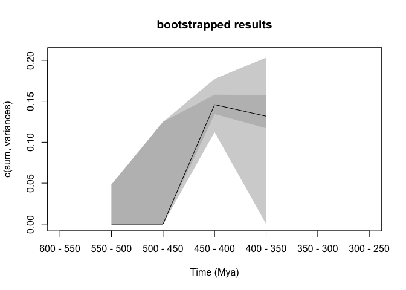

Early vertebrates dispRity pipeline
================
RPDearden
06/11/2018

This is me having a play with the functionalities of dispRity, using the matrix from [Keating *et al.* 2016](http://rspb.royalsocietypublishing.org/content/283/1826/20152917). The tree is a majority rule consensus I obtained by running the dataset in PAUP\*, and the dates are cobbled together from the literature.

### Preliminaries

Read in required packages

``` r
library(dispRity)
library(geomorph)
library(vegan)
library(cluster)
library(Claddis)
```

Set directory and read in nexus file

``` r
setwd("~/Documents/Side_projects/Masters_writeup/EarlyVerts_R_Code/dispRity_Pipeline")
Kdata <- ReadMorphNexus("Keating16.nex")
Ktree <- read.nexus("KeatMaj.tre")
Kdates <- read.csv("Keating16Dates.csv", header=TRUE,row.names=1)
```

Ordinate - currently lazily using default Claddis.ordination settings, but have a think about appropriate methods

``` r
OrdKdata <- Claddis.ordination(Kdata)
```

### Doing disparity through time (disparity metric used the sum of variances as default)

tree requires a root time - for now guessed at start of Cambrian, choose a better one

``` r
Ktree$root.time <- 541
```

Order dates columns to match tip labels in tree (necessary for Claddis{DatePhylo})

``` r
Kdates <- Kdates[match(Ktree$tip.label, rownames(Kdates)),]
```

Date tree using Claddis tree dating - check dating method appropriate

``` r
DatedKtree<-DatePhylo(Ktree, Kdates, method="equal", rlen=1)
```

Make time bins (random 50my)

``` r
time_bins <- rev(seq(from = 250, to = 600, by = 50))
```

Split dataset into subsets

``` r
binned_Kdata <- chrono.subsets(data = OrdKdata, tree = Ktree, method = "discrete", time = time_bins, inc.nodes = FALSE,FADLAD = Kdates)
```

Bootstrapping , first just that and then with bonus rarefaction

``` r
boot_bin_Kdata <- boot.matrix(binned_Kdata)
rare_bin_Kdata <- boot.matrix(binned_Kdata, bootstraps = 100,rarefaction = 6)
```

Calculate disparity for both datasets

``` r
boot_disparity_Kdata <- dispRity(boot_bin_Kdata, metric = c(sum, variances))
rare_disparity_Kdata <- dispRity(rare_bin_Kdata, metric = c(sum, variances))
```

Plot it up

``` r
#quartz(width = 10, height = 5) ; par(mfrow = (c(1,2)), bty = "n")
plot(boot_disparity_Kdata, type = "continuous", main = "bootstrapped results")
```



``` r
plot(rare_disparity_Kdata, type = "continuous", main = "rarefied results")
```


Testing bins difference - won't work with this dataset as not enough data

``` r
#test.dispRity(boot_disparity_Kdata, test = wilcox.test, comparison = "sequential",correction = "bonferroni")
```
